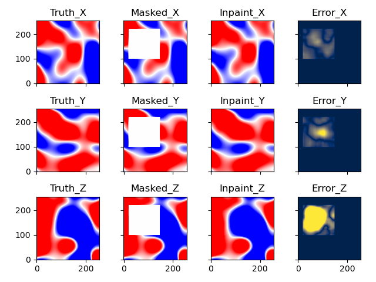
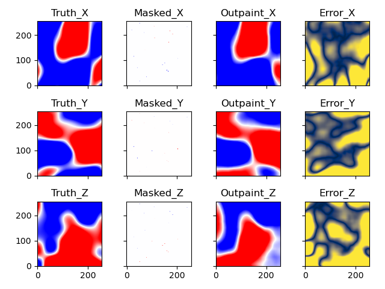

# Magnetic Field Prediction Using Generative Adversarial Networks

PyTorch implementation to predict magnetic field values at a random point in space from a few point measurements by using a generative adversarial network (GAN) structure. The work is inspired by [Generative Image Inpainting with Contextual Attention](https://arxiv.org/abs/1801.07892) and uses the PyTorch re-implementation from https://github.com/daa233/generative-inpainting-pytorch as baseline.
On top of that, we have added a so-called outpainting task, which is a combination of inter- and extrapolation.
Additionally, the code to generate the magnetic field data and the trained models to reproduce the reults of the paper can be downloaded.

For details, please see [Magnetic Field Prediction Using Generative Adversarial Networks](https://arxiv.org/abs/2203.07897).


## Quick start with conda

### Installation
```bash
conda install -y matplotlib pyyaml scipy scikit-learn scikit-image tensorboard notebook conda-build
```
- Install [PyTorch](https://pytorch.org/get-started/locally/)

### Reproduce results of paper
For different bounding box amounts and mask sizes. As methods, the baseline WGAN-GP, our physics-informed WGAN-GP, linear interpolation, spline-based interpolation, and biharmonic equations can be chosen. Trained generator networks can be found [here](https://github.com/spollok/magfield-prediction/tree/main/checkpoints/paper). For outpainting, Gaussian Process Regression is available.
In addition to the pre-trained models, which have been used in the paper, five sample magnetic fields are included in the data folder to be able to directly run predictions. The visualization of the results can then be found in the folder checkpoints/***exp***/***name***/test/figs.

- Inpainting with one mask of resolution 144 x 144

    ```bash
    python test.py --name in_ext_div_curl_1_144_1 --box_amount 1 --mask_size 144 --method wgan --err_scale 0.01 --exp paper --cfg_file test_in.yaml
    ````

    

- Outpainting from 20 magnetic field values

    ```bash
    python test.py --name out_one_div_curl_20_1_1 --box_amount 20 --mask_size 1 --method wgan --err_scale 0.03 --exp paper --cfg_file test_out.yaml
    ```

    


## Data generation with MagTense

### Prerequisites

```bash
conda install -y numpy
conda install -y -c conda-forge tqdm
```
- Install [ray](https://docs.ray.io/en/latest/ray-overview/installation.html)
- Install [magtense](https://github.com/cmt-dtu-energy/MagTense/tree/master/python)

### Hint

- Using multiple workers to generate data can lead to memory issues. Limiting the number of workers should resolve the error.


## Physics-informed WGAN-GP training

After the magnetic field data has been produced. A new generator can be trained. The configuration for the run can be set in a [YAML-file](https://github.com/spollok/magfield-prediction/blob/main/configs/config.yaml).

```bash
python train.py
```
